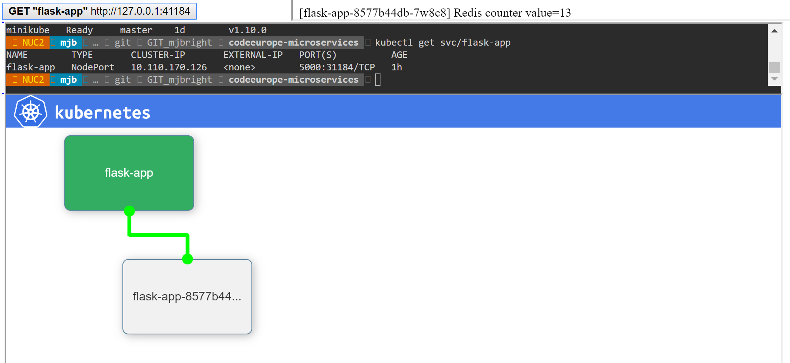
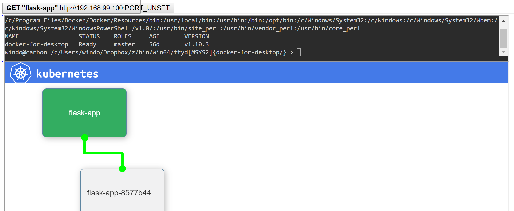
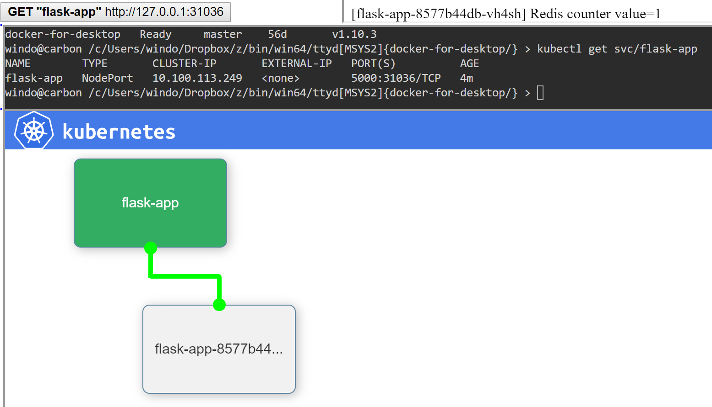
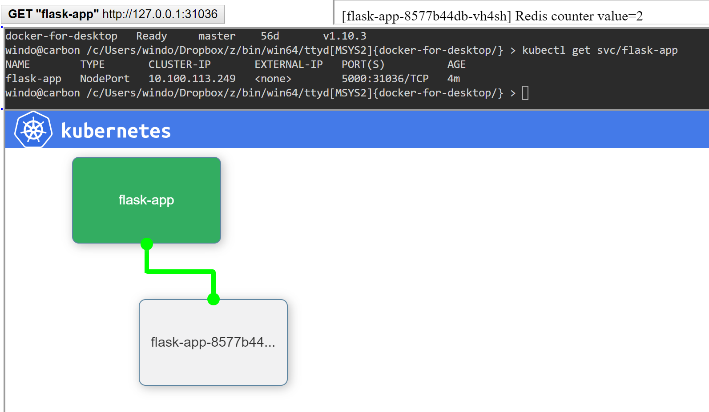
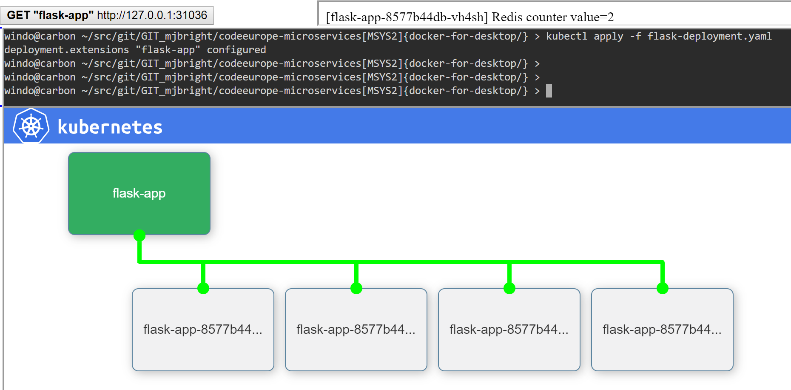
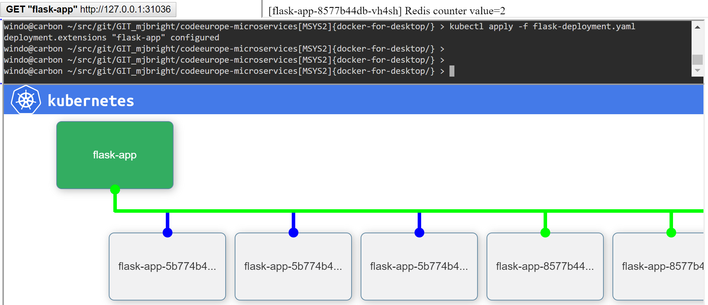
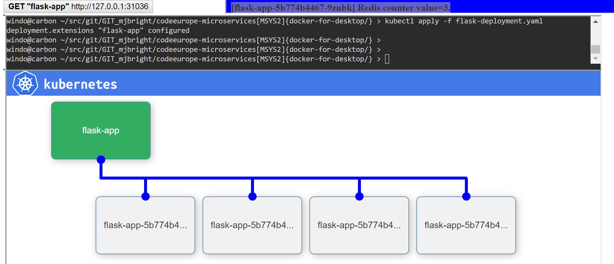
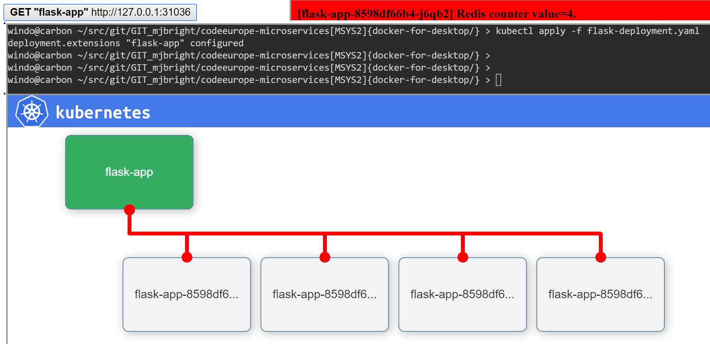

# CodeEurope.pl Microservices talk demos

This repo contains the Microservice/Kubernetes examples I created for my "Developing Micro-services with Kubernetes" talks given in April 2018 at CodeEurope.pl in Warsaw and Wroclaw, Poland.

Refer to [https://mjbright.github.io/Talks/index.html#201804_codeeu](https://mjbright.github.io/Talks/index.html#201804_codeeu) for the slides and other information about those talks.

**A revised version will be available after Pyconfr, Lille happening in October 2018.**



The demo at Wroclaw was run on a Mac AirBook Pro using

- minikube as a single-node Kubernetes cluster
- a simple demo dashboard integrating a test button & output, a shell console and a cluster visualization

The demo has also been tested/documented on

- Windows10 using Docker Desktop to provide the Kubernetes cluster, using a MSYS2 buid of ttyd.
- Ubuntu 18.04.1 LTS


## The demo dashboard

The demo dashboard integrates several components

- the button and output for a simple Flask/Redis counter application
- a web console based on ttyd: allowing running of shell commands in the demo browser window
- a Kubernetes visualization 

### Flask/Redis counter application

You don't need to rebuild this application, you can use the '*mjbright/flask-web*' images available on DockerHub.

The steps to deploy these images are described later in this document.

Nevertheless the sources for this application are located in the subdirectory kubernetes-flask-redis-microservice along with a script to automatically build the different versions of the app (v1, v2, v3) used in the demo.

### Kubernetes visualization 

The visualizer is derived from a fork of Brendan Burns' K8S visualizer, implemented using jsPlumb library.

A modified version is integrated into the demo, it's sources are in the subdirectory live-k8s-visualizer, along with a script to start the visualizer.

The steps to deploy the visualizer are described later in this document.

# To run the demos: 


## Demo Steps

### Slides

Refer to [https://mjbright.github.io/Talks/index.html#201804_codeeu](https://mjbright.github.io/Talks/index.html#201804_codeeu) for the slides and other information about those talks.

You can refer to the presentation slides to see the commands used.

The demo steps are described from [slide#23](https://mjbright.github.io/Talks/2018-Apr-26_CodeEurope_DevMicroServicesWithKubernetes/#43) onwards.

### Deploy Redis

```
kubectl apply -f redis-deployment.yaml
```

### Deploy Flask

```
kubectl apply -f flask-deployment.yaml
```

### Expose the Redis Service

```
kubectl apply -f redis-service.yaml
```

### Expose the Flask Service

```
kubectl apply -f flask-service.yaml
```

*NOTE*: We have not yet set the exposed service port in our demo page - the button still displays PORT_UNSET.




#### Update the demo page to set the service port

We rerun the create_demo_html.sh script now with the '-s' option to recuperate the service port:

```
cd live-k8s-visualizer/

./create_demo_html.sh -s
```

Now reload the demo page and we see that the port number now appears in the button and the first request to our service has been made "Redis counter value=1".



Press the button to see the value increment.



### Scale the flask-app

In the file flask-deployment.yaml, modify the line

<pre>     replicas: 1 </pre>

to

<pre>     replicas: 4 </pre>

Now reapply this resource file:

```
kubectl apply -f flask-deployment.yaml
```



### Rollout an upgrade to the flask-app

In the file flask-deployment.yaml, modify the line

<pre>     - image: mjbright/flask-web:v1 </pre>

to

<pre>     - image: mjbright/flask-web:v2 </pre>

Now reapply this resource file:

```
kubectl apply -f flask-deployment.yaml
```





### Rollout an upgrade to the flask-app

In the file flask-deployment.yaml, modify the line

<pre>     - image: mjbright/flask-web:v2 </pre>

to

<pre>     - image: mjbright/flask-web:v3 </pre>

Now reapply this resource file:

```
kubectl apply -f flask-deployment.yaml
```




