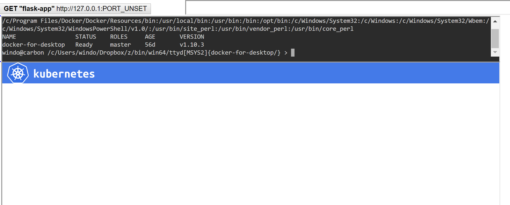

# CodeEurope.pl Microservices talk demos


This repo contains the Microservice/Kubernetes examples used in my 2018-Apr presentations at CodeEurope in Warsaw and Wroclaw, Poland.


Refer to [https://mjbright.github.io/Talks/index.html#201804_codeeu](https://mjbright.github.io/Talks/index.html#201804_codeeu) for the slides and other information about those talks.

The demo at Wroclaw was run on a Mac AirBook Pro using

- minikube as a single-node Kubernetes cluster
- a simple demo dashboard integrating a test button & output, a shell console and a cluster visualization

The demo has also been tested/documented on

- Windows10 using Docker Desktop to provide the Kubernetes cluster, using a MSYS2 buid of ttyd.
- Ubuntu 18.04.1 LTS

**A revised version will be available after Pyconfr, Lille happening in October 2018.**

## The demo dashboard

The demo dashboard integrates several components

- the button and output for a simple Flask/Redis counter application
- a web console based on ttyd: allowing running of shell commands in the demo browser window
- a Kubernetes visualization 

### Flask/Redis counter application

You don't need to rebuild this application, you can use the '*mjbright/flask-web*' images available on DockerHub.

The steps to deploy these images are described later in this document.

Nevertheless the sources for this application are located in the subdirectory kubernetes-flask-redis-microservice along with a script to automatically build the different versions of the app (v1, v2, v3) used in the demo.

### Kubernetes visualization 

The visualizer is derived from a fork of Brendan Burns' K8S visualizer, implemented using jsPlumb library.

A modified version is integrated into the demo, it's sources are in the subdirectory live-k8s-visualizer, along with a script to start the visualizer.

The steps to deploy the visualizer are described later in this document.

# To run the demos: Setup steps

## Create your own Kubernetes cluster.

It is recommended to use minikube for this, but you may choose other methods.

On Windows it may be easier to use Docker Desktop which now provides Kubernetes in the stable channel.

You can download the latest version of minikube for your OS (Linux, Windows, macOS) from the release page [https://github.com/kubernetes/minikube/releases](https://github.com/kubernetes/minikube/releases).

Type ```minikube start``` to start the cluster, this may take some time especially if it is necessary to download the iso and associated containers over a slow network.

Once finished check that you can access your cluster using kubectl.

Run

```kubectl get nodes```

you should see something like:

<pre>
NAME       STATUS    ROLES     AGE       VERSION
minikube   Ready     master    15m       v1.10.0
</pre>

## Create the "demo dashboard"


### [optional] Installing/running ttyd
To run the dashboard you optionally require the ttyd daemon installed (to allow to type console commands locally in the browser window).

Executables are readily available for Linux and MacOS on the [release page](https://github.com/tsl0922/ttyd/releases).
ttyd is available on macOS via brew.

On Windows you will first need to install MSYS2 and then compile your own executable, instructions are provided for this [here](https://github.com/tsl0922/ttyd/tree/master/msys2).  I would have made a Windows executable available but following the instructions only created a dynamically linked executable, ... 

Once you have ttyd available launch the executable.

**Note:** we are launching ttyd without any special security ... be careful, you may want to investigate use of https, if accessing from another machine.

```
cd live-k8s-visualizer/

launch_ttyd.sh -r
```

### Running the Visualizer:

#### In a separate terminal window launch the visualizer:

```
cd live-k8s-visualizer/

./visualize.sh
```

Note: if accessing remotely run with the '-r' option:
```
cd live-k8s-visualizer/

./visualize.sh -r
```

### Create the "demo dashboard" page

We will create the dashboard from a template, populated with the URLs

- to the flask-web app (we will need to run the script again later once the app has been deployed).
- to the ttyd shell daemon
- the visualizer

```
cd live-k8s-visualizer/

./create_demo_html.sh
```

**Note**: Initially we cannot set the service port, and so the button shows the URL as something like http://192.168.99.100:PORT_UNSET - see image below.

Later when the service has been started we will rerun create_demo_html.sh with the option '-s' to set the port of the exposed flask-app service.

### Open the "demo dashboard"

You can open the dashboard in your browser either using

- file protocol
- or via a local web server

In my case under Windows I had the files under

- [cygwin path] ```/home/windo/src/git/GIT_mjbright/codeeurope-microservices```
- [DOS path] ```C:\tools\cygwin\home\windo\src\git\GIT_mjbright\codeeurope-microservices```


#### Accessing the *demo dashboard* using local files:
I can access the *demo dashboard* in my browser using:
```
    file:///C:/tools/cygwin/home/windo/src/git/GIT_mjbright/codeeurope-microservices/demo.html
```

Alternatively I could launch a web server, e.g. using Python3, from the codeeurope-microservices repo directory as such:

```
    cd C:/tools/cygwin/home/windo/src/git/GIT_mjbright/codeeurope-microservices/
    cd live-k8s-visualizer/

    python3 -m http.server 8000 --bind 127.0.0.1
```

to serve up files just on the same machine, or if you want to access from another machine:
```
cd live-k8s-visualizer/

/usr/bin/python3 -m http.server 8000 --bind 0.0.0.0
```

#### Accessing the *demo dashboard* using a web server:
You can now open your browser at
```http://127.0.0.1:8000/demo.html```

Replace ```127.0.0.1``` by the remote ip if running on a different machine




## Demo Steps

### Slides

Refer to [https://mjbright.github.io/Talks/index.html#201804_codeeu](https://mjbright.github.io/Talks/index.html#201804_codeeu) for the slides and other information about those talks.

You can refer to the presentation slides to see the commands used.

The demo steps are described from [slide#23](https://mjbright.github.io/Talks/2018-Apr-26_CodeEurope_DevMicroServicesWithKubernetes/#43) onwards.

### Deploy Redis

```
kubectl apply -f redis-deployment.yaml
```

### Deploy Flask

```
kubectl apply -f flask-deployment.yaml
```

### Expose the Redis Service

```
kubectl apply -f redis-service.yaml
```

### Expose the Flask Service

```
kubectl apply -f flask-service.yaml
```

*NOTE*: We have not yet set the exposed service port in our demo page - the button still displays PORT_UNSET.


#### Update the demo page to set the service port

We rerun the create_demo_html.sh script now with the '-s' option to recuperate the service port:

```
cd live-k8s-visualizer/

./create_demo_html.sh -s
```

Now reload the demo page and we see that the port number now appears in the button and the first request to our service has been made "Redis counter value=1".


Press the button to see the value increment.


